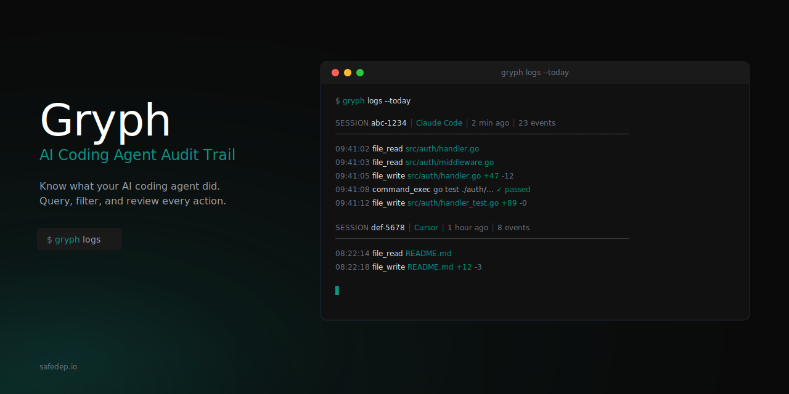

<p align="center">
  
</p>

<p align="center">
  <strong>Know what your AI coding agent did. Query, filter, and review every action.</strong>
</p>

<p align="center">
  <a href="#installation">Installation</a> •
  <a href="#quick-start">Quick Start</a> •
  <a href="#commands">Commands</a> •
  <a href="#supported-agents">Supported Agents</a>
</p>

---

AI coding agents read files, write code, and execute commands on your behalf. But what exactly did they do?

**Gryph** is a local-first audit trail for AI coding agents. It hooks into your agents, logs every action to a local SQLite database, and gives you powerful querying capabilities to understand, review, and debug agent activity.

## Why Gryph?

- **Transparency** - See exactly what files were read, written, and what commands were run
- **Pre-commit review** - Verify agent changes before committing to git
- **Debugging** - Replay sessions to understand what went wrong
- **Privacy** - All data stays local. No cloud, no telemetry

## Installation

<!-- PLACEHOLDER: Installation instructions will be added after release -->

```bash
# Coming soon
# brew install safedep/tap/gryph
# go install github.com/safedep/gryph/cmd/gryph@latest
```

## Quick Start

```bash
# Install hooks for all detected agents
gryph install

# Verify installation
gryph status

# Start using your AI coding agent (Claude Code, Cursor, etc.)
# ...

# Review what happened
gryph logs
```

## Commands

### View Recent Activity

```bash
# Show last 24 hours
gryph logs

# Today's activity
gryph logs --today

# Filter by agent
gryph logs --agent claude-code

# Stream events in real-time
gryph logs --follow
```

### Query Historical Data

```bash
# Find all writes to specific files
gryph query --file "src/auth/**" --action file_write

# Commands run in the last week
gryph query --action command_exec --since "1w"

# Activity from a specific session
gryph query --session abc123
```

### Session Details

```bash
# List all sessions
gryph sessions

# View detailed session history
gryph session <session-id>
```

### View File Diffs

```bash
# See what changed in a specific write event
gryph diff <event-id>
```

### Export for Analysis

```bash
# Export to JSON
gryph export --format json -o audit.json

# Export specific time range
gryph export --since "1w" --format csv
```

### Health Check

```bash
# Check installation status
gryph status

# Diagnose issues
gryph doctor
```

## Supported Agents

| Agent | Status | Hook Support |
|-------|--------|--------------|
| **Claude Code** | Supported | Full (PreToolUse, PostToolUse, Notification) |
| **Cursor** | Supported | Full (file read/write, shell execution, MCP tools) |

## Configuration

Gryph works out of the box with sensible defaults. Configuration is optional.

```bash
# View current config
gryph config show

# Set logging level (minimal, standard, full)
gryph config set logging.level full
```

**Logging levels:**
- `minimal` - Action type, file path, timestamp (default)
- `standard` - + diff stats, exit codes, truncated output
- `full` - + file diffs, raw events, conversation context

Sensitive files (`.env`, `*.pem`, `*secret*`, etc.) are detected automatically - actions are logged but content is never stored.

## How It Works

```
┌─────────────────┐     ┌─────────────┐     ┌─────────────┐
│   AI Agent      │────>│   Gryph     │────>│   SQLite    │
│ (Claude/Cursor) │     │   Hooks     │     │   Database  │
└─────────────────┘     └─────────────┘     └─────────────┘
                                                   │
                              ┌────────────────────┘
                              │
                              ▼
                        ┌─────────────┐
                        │  gryph CLI  │
                        │  logs/query │
                        └─────────────┘
```

Gryph installs lightweight hooks into your AI agents. When the agent performs an action (read file, write file, execute command), the hook sends a JSON event to Gryph, which stores it locally. You can then query this audit trail anytime.

## License

Apache 2.0 - See [LICENSE](LICENSE) for details.

---

<p align="center">
  Built by <a href="https://safedep.io">SafeDep</a>
</p>
