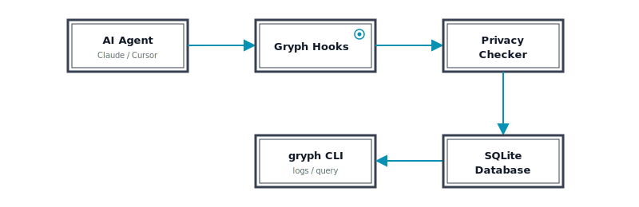

<p align="center">
  <a href="https://safedep.io">
    <picture>
      <source srcset="docs/assets/gryph-banner-dark.svg" media="(prefers-color-scheme: dark)">
      <source srcset="docs/assets/gryph-banner-light.svg" media="(prefers-color-scheme: light)">
      
    </picture>
  </a>
</p>

<p align="center">
  <strong>Know what your AI coding agent did. Query, filter, and review every action.</strong>
</p>

<p align="center">
  <a href="#installation">Installation</a> •
  <a href="#quick-start">Quick Start</a> •
  <a href="#commands">Commands</a> •
  <a href="#supported-agents">Supported Agents</a>
</p>

<div align="center">

[](https://safedep.io)
[](https://discord.gg/kAGEj25dCn)

[](https://goreportcard.com/report/github.com/safedep/gryph)


[](https://github.com/safedep/gryph/actions/workflows/codeql.yml)

</div>

<div align="center">
  <picture>
    
  </picture>
</div>

---

**Gryph** is a local-first audit trail for AI coding agents. It hooks into your agents, logs every action to a local SQLite database, and gives you powerful querying capabilities to understand, review, and debug agent activity.

## Why Gryph?

- **Transparency** - See exactly what files were read, written, and what commands were run
- **Audit Trail** - See exactly what your AI coding agent did
- **Debugging** - Replay sessions to understand what went wrong
- **Privacy** - All data stays local. No cloud, no telemetry

## Installation

```bash
# Install with Homebrew on MacOS and Linux
brew install safedep/tap/gryph

# Install using npm
npm install -g @safedep/gryph

# Install using Go
go install github.com/safedep/gryph/cmd/gryph@latest
```

## Quick Start

```bash
# Install hooks for all detected agents
gryph install

# Verify installation
gryph status

# Start using your AI coding agent
# ...

# Review what happened
gryph logs
```

> [!TIP]
> Set `logging.level` to `full` in your `gryph config` to see file diffs and raw events.
> You can do this by running `gryph config set logging.level full`. See [Configuration](#configuration) for more details.

<details>
  <summary>Files Modified During Installation</summary>
  
### Files Modified During Installation

For transparency, here are the files Gryph modifies when you run `gryph install`:

| Agent       | File Modified                          | Description                              |
| ----------- | -------------------------------------- | ---------------------------------------- |
| Claude Code | `~/.claude/settings.json`              | Adds hook entries to the `hooks` section |
| Cursor      | `~/.cursor/hooks.json`                 | Creates or updates hooks configuration   |
| Gemini CLI  | `~/.gemini/settings.json`              | Adds hook entries to the `hooks` section |
| OpenCode    | `~/.config/opencode/plugins/gryph.mjs` | Installs JS plugin that bridges to gryph |
| Windsurf    | `~/.codeium/windsurf/hooks.json`       | Creates or updates hooks configuration   |

### Backups

Existing files are automatically backed up before modification. Backups are stored in the Gryph data directory:

| Platform | Backup Location                                |
| -------- | ---------------------------------------------- |
| macOS    | `~/Library/Application Support/gryph/backups/` |
| Linux    | `~/.local/share/gryph/backups/`                |
| Windows  | `%LOCALAPPDATA%\gryph\backups\`                |

Backup files are named with timestamps (e.g., `settings.json.backup.20250131120000`).

</details>

## Commands

> For a complete reference of all commands and flags, see [CLI Reference](docs/cli-reference.md).

### Install & Uninstall Hooks

```bash
# Install hooks for all detected agents
gryph install

# Preview what would be installed
gryph install --dry-run

# Install for a specific agent
gryph install --agent claude-code

# Remove hooks from all agents
gryph uninstall

# Remove hooks and purge all data
gryph uninstall --purge

# Restore original hook config from backup
gryph uninstall --restore-backup
```

### View Recent Activity

```bash
# Show last 24 hours
gryph logs

# Today's activity
gryph logs --today

# Filter by agent
gryph logs --agent claude-code

# Stream events in real-time
gryph logs --follow

# Output as JSON
gryph logs --format json
```

### Query Historical Data

```bash
# Find all writes to specific files
gryph query --file "src/auth/**" --action file_write

# Commands run in the last week
gryph query --action command_exec --since "1w"

# Activity from a specific session
gryph query --session abc123

# Count matching events
gryph query --action file_write --today --count

# Filter by command pattern
gryph query --command "npm *" --since "1w"

# Include file diffs in output
gryph query --action file_write --show-diff
```

### Session Details

```bash
# List all sessions
gryph sessions

# View detailed session history
gryph session <session-id>

# View session with file diffs
gryph session <session-id> --show-diff
```

### View File Diffs

```bash
# See what changed in a specific write event
gryph diff <event-id>
```

### Export for Analysis

```bash
# Export to JSON
gryph export --format json -o audit.json

# Export specific time range
gryph export --since "1w" --format csv
```

**Note:** The `export` sub-command export raw events following a verifiable JSON schema. 
This schema is different from the TUI views used to render user friendly log, query etc.
See [event.schema.json](./schema/event.schema.json).

### Manage Data

```bash
# View retention policy and stats
gryph retention status

# Clean up events older than retention period
gryph retention cleanup

# Preview what would be deleted
gryph retention cleanup --dry-run

# View gryph's own audit trail (installs, config changes)
gryph self-log
```

### Statistics Dashboard

```bash
# Launch interactive stats TUI
gryph stats

# Stats for the last 7 days
gryph stats --since 7d

# Filter by agent
gryph stats --since 30d --agent claude-code
```

### Health Check

```bash
# Check installation status
gryph status

# Diagnose issues
gryph doctor
```

## Supported Agents

| Agent           | Status    | Hook Support                                       |
| --------------- | --------- | -------------------------------------------------- |
| **Claude Code** | Supported | Full (PreToolUse, PostToolUse, Notification)       |
| **Cursor**      | Supported | Full (file read/write, shell execution, MCP tools) |
| **Gemini CLI**  | Supported | Full (BeforeTool, AfterTool, Notification)         |
| **OpenCode**    | Supported | Full (tool.execute, session events)                |
| **Windsurf**    | Supported | Full (file read/write, commands, MCP tools)        |

## Configuration

Gryph works out of the box with sensible defaults. Configuration is optional.

```bash
# View current config
gryph config show

# Get a specific value
gryph config get logging.level

# Set logging level (minimal, standard, full)
gryph config set logging.level full

# Reset to defaults
gryph config reset
```

**Logging levels:**
- `minimal` - Action type, file path, timestamp (default)
- `standard` - + diff stats, exit codes, truncated output
- `full` - + file diffs, raw events, conversation context

Sensitive files (`.env`, `*.pem`, `*secret*`, etc.) are detected automatically - actions are logged but content is never stored.

## Privacy

Gryph is designed with privacy as a core principle. All data stays on your machine. There is no cloud component or telemetry.

- **Sensitive file detection** — Files matching patterns like `.env`, `*.pem`, `*.key`, `*secret*`, `.ssh/**`, `.aws/**`, and others are automatically detected. Actions on these files are logged but their content is never stored.
- **Content redaction** — Passwords, API keys, tokens, bearer credentials, and AWS keys are automatically redacted from any logged output using pattern matching.
- **Content hashing** — File contents are stored as SHA-256 hashes by default (`logging.content_hash: true`), allowing you to verify file identity without storing the actual content.
- **Configurable logging levels** — Control how much detail is captured with `minimal`, `standard`, or `full` logging levels.
- **Local-only storage** — All audit data is stored in a local SQLite database with configurable retention (default 90 days).

Sensitive path patterns and redaction rules are fully configurable via `gryph config`.

## How It Works

<picture>
  <source srcset="docs/assets/gryph-architecture-dark.svg" media="(prefers-color-scheme: dark)">
  <source srcset="docs/assets/gryph-architecture-light.svg" media="(prefers-color-scheme: light)">
  
</picture>

Gryph installs lightweight hooks into your AI agents. When the agent performs an action (read file, write file, execute command), the hook sends a JSON event to Gryph, which stores it locally. You can then query this audit trail anytime.

## Community

Questions, feedback, or want to discuss AI agent security? Join us on Discord.

<p align="center">
  <a href="https://discord.gg/kAGEj25dCn"><strong>Join the SafeDep Discord</strong></a>
</p>

## License

Apache 2.0 - See [LICENSE](LICENSE) for details.

---

<p align="center">
  Built by <a href="https://safedep.io">SafeDep</a> · <a href="https://discord.gg/kAGEj25dCn">Discord</a>
</p>
