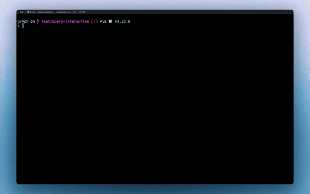
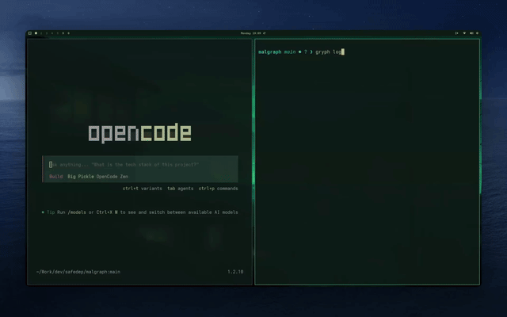
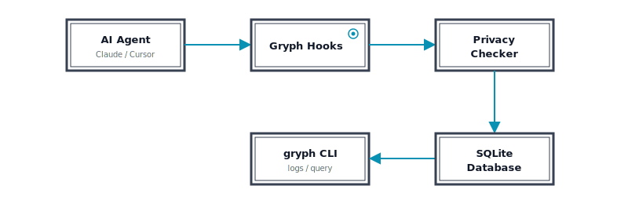
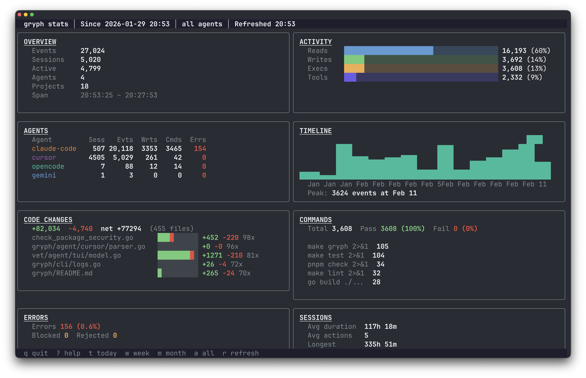

<p align="center">
  <a href="https://safedep.io">
    <picture>
      <source srcset="docs/assets/gryph-banner-dark.svg" media="(prefers-color-scheme: dark)">
      <source srcset="docs/assets/gryph-banner-light.svg" media="(prefers-color-scheme: light)">
      
    </picture>
  </a>
</p>

<h3 align="center">AI coding agents have no security boundaries. Gryph is building one.</h3>

<p align="center">
  Everyone runs YOLO mode. Nobody checks what happened. Gryph does.
</p>

<p align="center">
  <a href="#quick-start">Quick Start</a> ·
  <a href="#see-it-in-action">Demo</a> ·
  <a href="#supported-agents">Supported Agents</a> ·
  <a href="#use-cases">Use Cases</a>
</p>

<div align="center">


[](https://goreportcard.com/report/github.com/safedep/gryph)


[](https://github.com/safedep/gryph/actions/workflows/codeql.yml)
[](https://safedep.io)
[](https://discord.gg/kAGEj25dCn)

</div>

---

AI coding agents (Claude Code, Cursor, Windsurf, Gemini CLI, OpenCode) can read any file, write anywhere, and execute arbitrary commands on a developer's machine. They run dozens of tool calls per session. When something goes wrong, there is no audit trail.

**Gryph fixes that.** It hooks into agents, logs every action to a local SQLite database, and provides powerful querying to understand, review, and debug agent activity. All data stays local. No cloud, no telemetry.

<div align="center">
  
</div>

## The Problem

A developer asks Claude Code to refactor a module. It runs 47 tool calls in 90 seconds. Then the tests fail.

- Which files did the agent read before making changes?
- Did it run shell commands that were not expected?
- Did it touch config files, secrets, or CI pipelines?
- What did the file look like before and after?

Without Gryph, developers are left guessing. With Gryph, `gryph logs` shows everything.

## Quick Start

```bash
# Install Gryph with one command
curl -fsSL https://raw.githubusercontent.com/safedep/gryph/main/install.sh | sh

# Setup gryph for available agents
gryph install                    # hooks into all detected agents
gryph status                     # verify setup

# ... use your AI agent normally ...
gryph logs                       # see what happened
```

<details>
<summary>Other install methods</summary>

```bash
# Homebrew (macOS/Linux)
brew install safedep/tap/gryph

# npm
npm install -g @safedep/gryph

# Go
go install github.com/safedep/gryph/cmd/gryph@latest
```

Pre-built binaries for macOS, Linux, and Windows are available on the [GitHub Releases](https://github.com/safedep/gryph/releases) page.

</details>

> **Tip:** Set `logging.level` to `full` to see file diffs and raw events:
> `gryph config set logging.level full`. See [Configuration](#configuration) for details.

## Supported Agents

| Agent | Hook Support |
| --- | --- |
| **Claude Code** | Full (PreToolUse, PostToolUse, Notification) |
| **Codex** | Full (PreToolUse, PostToolUse, SessionStart, UserPromptSubmit, Stop) |
| **Cursor** | Full (file read/write, shell execution, MCP tools) |
| **Gemini CLI** | Full (BeforeTool, AfterTool, Notification) |
| **OpenCode** | Full (tool.execute, session events) |
| **Pi Agent** | Full (tool_call, tool_result, session events) |
| **Windsurf** | Full (file read/write, commands, MCP tools) |

> **Note:** Codex hooks require enabling the `codex_hooks` feature flag in your Codex configuration (`~/.codex/config.toml`):
> ```toml
> [features]
> codex_hooks = true
> ```

One command installs hooks for all detected agents. No per-agent setup required.

## See It in Action

Live streaming of agent actions as they happen with `gryph logs --live`:

<div align="center">
  
</div>

## Use Cases

| Scenario | How Gryph Helps |
| --- | --- |
| **Replay the full session** | `git diff` shows final changes. Gryph shows the full sequence: what the agent read, what it ran, what it wrote and reverted, and in what order. |
| **Catch invisible side effects** | Agents run shell commands that leave no trace in git (`npm install`, `curl`, `rm`). `gryph query --action exec` surfaces them all. |
| **Sensitive file access** | Gryph flags access to `.env`, `*.pem`, `*.key`, and similar files automatically. Actions are logged but content is never stored. |
| **Security review** | Export events to your SIEM, or use the [OpenSearch observability example](examples/ai-coding-observability/) for centralized dashboards and threat detection alerts. |
| **Cost and token tracking** | Track per-session token usage and estimated costs across models and agents. [See docs](docs/cost.md) |
| **Compare agents** | Filter by `--agent` to see how different agents approach the same task: which reads more, which runs more commands, which costs more. |

## How It Works

<picture>
  <source srcset="docs/assets/gryph-architecture-dark.svg" media="(prefers-color-scheme: dark)">
  <source srcset="docs/assets/gryph-architecture-light.svg" media="(prefers-color-scheme: light)">
  
</picture>

Gryph installs lightweight hooks into AI coding agents. When an agent reads a file, writes a file, or executes a command, the hook sends a JSON event to Gryph. Events are stored in a local SQLite database and can be queried anytime. Because Gryph hooks into both **pre-tool** and **post-tool** events, it captures the full lifecycle of every agent action.

## Commands

> For a complete reference of all commands and flags, see [CLI Reference](docs/cli-reference.md).

### Install and Uninstall Hooks

```bash
gryph install                      # Install hooks for all detected agents
gryph install --dry-run            # Preview what would be installed
gryph install --agent claude-code  # Install for a specific agent
gryph uninstall                    # Remove hooks from all agents
gryph uninstall --purge            # Remove hooks and purge all data
gryph uninstall --restore-backup   # Restore original hook config from backup
```

### View Recent Activity

```bash
gryph logs                     # Last 24 hours
gryph logs --today             # Today's activity
gryph logs --agent claude-code # Filter by agent
gryph logs --follow            # Stream events in real time
gryph logs --format json       # Output as JSON
```

### Query Historical Data

```bash
gryph query --file "src/auth/**" --action file_write    # Find writes to specific files
gryph query --action exec --since "1w"           # Commands run in the last week
gryph query --session abc123                             # Activity from a specific session
gryph query --action file_write --today --count          # Count matching events
gryph query --command "npm *" --since "1w"               # Filter by command pattern
gryph query --action file_write --show-diff              # Include file diffs
```

### Sessions

```bash
gryph sessions                        # List all sessions
gryph session <session-id>            # View detailed session history
gryph session <session-id> --show-diff # View session with file diffs
```

### Diffs and Export

```bash
gryph diff <event-id>                                  # See what changed in a write event

gryph export                                           # Export last hour as JSONL to stdout
gryph export --since "1w" -o audit.jsonl               # Export last week to file
gryph export --agent claude-code --sensitive            # Include sensitive events
gryph export --since 1d | jq -r '.action_type' | sort | uniq -c | sort -rn
```

Each exported line includes a `$schema` field pointing to [event.schema.json](./schema/event.schema.json).
Sensitive events are excluded by default; use `--sensitive` to include them.
See [CLI Automation](./docs/cli-automation.md) for more `jq` recipes.

### Statistics Dashboard

<div align="center">
  <picture>
    
  </picture>
</div>

```bash
gryph stats                               # Interactive stats TUI
gryph stats --since 7d                    # Stats for the last 7 days
gryph stats --since 30d --agent claude-code # Filter by agent
```

### Data Management

```bash
gryph retention status         # View retention policy and stats
gryph retention cleanup        # Clean up old events
gryph retention cleanup --dry-run # Preview what would be deleted
gryph self-log                 # View gryph's own audit trail
```

### Health Check

```bash
gryph status  # Check installation status
gryph doctor  # Diagnose issues
```

## Configuration

Gryph works out of the box. Configuration is optional.

```bash
gryph config show                       # View current config
gryph config get logging.level          # Get a specific value
gryph config set logging.level full     # Set logging level
gryph config reset                      # Reset to defaults
```

**Logging levels:**

- `minimal` : Action type, file path, timestamp
- `standard` : Adds diff stats, exit codes, truncated output (default)
- `full` : Adds file diffs, raw events, conversation context

Sensitive files (`.env`, `*.pem`, `*secret*`, etc.) are detected automatically. Actions on these files are logged but content is never stored.

## Privacy

All data stays on the local machine. There is no cloud component, no telemetry, no tracking.

- **Sensitive file detection** : Files matching `.env`, `*.pem`, `*.key`, `*secret*`, `.ssh/**`, `.aws/**` and more are automatically flagged. Actions are logged but content is never stored.
- **Content redaction** : Passwords, API keys, tokens, and credentials are automatically redacted from logged output.
- **Content hashing** : File contents are stored as SHA-256 hashes by default, allowing identity verification without storing actual content.
- **Local-only storage** : SQLite database with configurable retention (default 90 days).

<details>
  <summary>Files Modified During Installation</summary>

### Files Modified During Installation

For transparency, these are the files Gryph modifies during `gryph install`:

| Agent | File Modified | Description |
| --- | --- | --- |
| Claude Code | `~/.claude/settings.json` | Adds hook entries to the `hooks` section |
| Codex | `~/.codex/hooks.json` | Creates or updates hooks configuration |
| Cursor | `~/.cursor/hooks.json` | Creates or updates hooks configuration |
| Gemini CLI | `~/.gemini/settings.json` | Adds hook entries to the `hooks` section |
| OpenCode | `~/.config/opencode/plugins/gryph.mjs` | Installs JS plugin that bridges to gryph |
| Windsurf | `~/.codeium/windsurf/hooks.json` | Creates or updates hooks configuration |

### Backups

Existing files are automatically backed up before modification. Backups are stored in the Gryph data directory:

| Platform | Backup Location |
| --- | --- |
| macOS | `~/Library/Application Support/gryph/backups/` |
| Linux | `~/.local/share/gryph/backups/` |
| Windows | `%LOCALAPPDATA%\gryph\backups\` |

Backup files are named with timestamps (e.g., `settings.json.backup.20250131120000`).

</details>

## Community

Questions, feedback, or contributions are welcome.

- **Discord** : [Join the SafeDep community](https://discord.gg/kAGEj25dCn)
- **Issues** : [Report bugs or request features](https://github.com/safedep/gryph/issues)
- **Contributing** : See [CONTRIBUTING.md](CONTRIBUTING.md) for guidelines

If Gryph is useful, consider [giving it a star](https://github.com/safedep/gryph/stargazers). It helps others discover the project.

## Star History

[](https://star-history.com/#safedep/gryph&Date)

## License

Apache 2.0. See [LICENSE](LICENSE) for details.

---

<p align="center">
  Built by <a href="https://safedep.io">SafeDep</a> · <a href="https://discord.gg/kAGEj25dCn">Discord</a> · <a href="https://github.com/safedep/gryph/stargazers">Star on GitHub</a>
</p>
