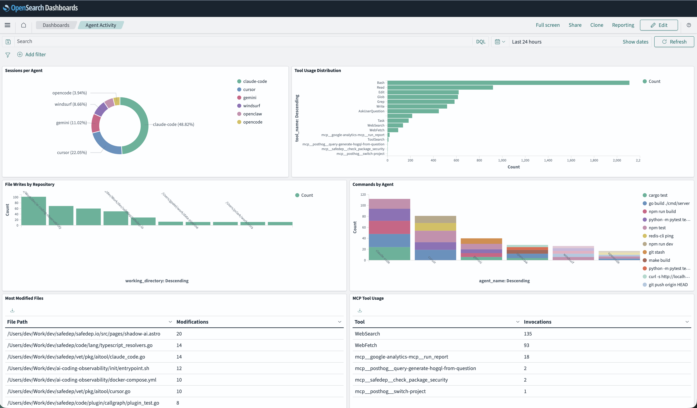
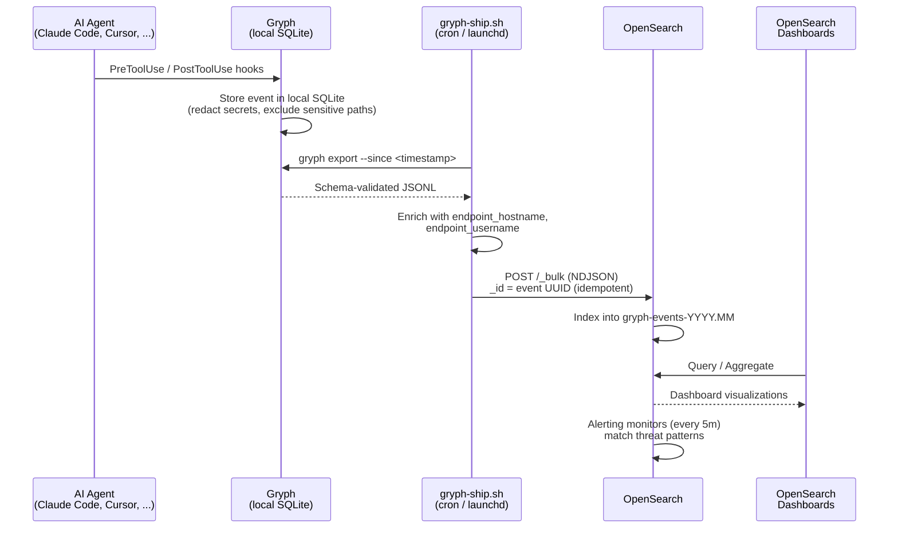

# AI Coding Agent Observability

Centralized observability for AI coding agents (Claude Code, Cursor, Gemini CLI, etc.) using [Gryph](https://github.com/safedep/gryph) + OpenSearch + OpenSearch Dashboards. Captures every agent action (shell commands, file reads/writes, tool invocations) across developer endpoints and surfaces them through SOC-facing dashboards with alerting.



## Key Features

- Team wide visibility into AI coding agent behavior across developer endpoints
- Security monitoring focused on real AI agent risk patterns
- SOC oriented dashboards for day to day operations
- Uses [Gryph](https://github.com/safedep/gryph) for agent observability

## Prerequisites

- Docker and Docker Compose
- Python 3.9+ with `pip install -r generator/requirements.txt`
- [Gryph](https://github.com/safedep/gryph) installed and configured

## Quick Start

### Setup

```bash
make setup
```

Generates a `.env` file with random OpenSearch credentials.

### Start the stack

```bash
make up
```

Starts OpenSearch, OpenSearch Dashboards, and an init container that automatically imports 4 dashboards, 5 alert monitors, index template, and retention policy.

Run `make status` to verify the cluster is healthy, indices are created, and all alert monitors are active.

### Ship Gryph data

```bash
make ship
```

Exports audit events from your local Gryph database and ships them to OpenSearch. Your machine's hostname and username appear in the dashboards.

Run this periodically or after AI agent sessions to keep dashboards current. To re-index all Gryph data from the beginning, delete the state file first: `rm ~/.local/state/gryph/last-export`

### Open dashboards

Open <http://localhost:5601> and navigate to Dashboards.

| Dashboard | What it shows |
|-----------|---------------|
| **SOC Overview** | Total events, active endpoints, error rates, event timeline, agent distribution |
| **Threat Detection** | Suspicious commands, sensitive file access, package installs, network exfiltration, MCP tool abuse |
| **Agent Activity** | Sessions per agent, tool usage, file modifications, activity heatmap |
| **Endpoint Health** | Reporting endpoints, last seen times, export gaps, error rates per endpoint |

### Check alert monitors

Navigate to Alerting > Monitors to see triggered alerts:

1. **Suspicious Command Execution** (Critical) : curl POST, base64 decode, netcat
2. **Sensitive File Access** (High) : .env, .pem, .key, .ssh, .aws reads
3. **Package Installation Detected** (High) : npm install, pip install, yarn add
4. **Endpoint Gone Silent** (Medium) : no events for 4+ hours
5. **High Error Rate** (Medium) : >20% errors from a single endpoint

### Synthetic data (optional)

If you want to populate dashboards without waiting for real agent activity, the included generator creates 7 days of realistic data across 20 simulated endpoints with embedded threat scenarios.

```bash
# Load 7 days of backfill data
make generate

# Or stream events in real time at ~5/sec
make stream
```

## How It Works

### Data flow



### Collection (`gryph-ship.sh`)

The collector script is designed to run on a schedule (launchd on macOS, cron on Linux). Each run:

1. Reads a state file (`~/.local/state/gryph/last-export`) for the last export timestamp
2. Calls `gryph export --since <timestamp>` to get new events
3. Enriches each event with `endpoint_hostname` and `endpoint_username`
4. Builds an NDJSON bulk request body with `_id` set to the Gryph event UUID
5. POSTs to OpenSearch `_bulk` API
6. Updates the state file on success; leaves it unchanged on failure so events retry next cycle

The UUID-based `_id` makes collection idempotent. Re-shipping the same event overwrites rather than duplicates.

### Index design

Events land in monthly indices (`gryph-events-2026.02`). The index template maps key fields as `keyword` for filtering and aggregation, `payload.command` as `text` with a `.keyword` subfield for both full-text search and exact match, and `raw_event` as a stored-but-not-indexed object for forensic access without indexing overhead.

An ISM policy auto-deletes indices older than 90 days.

### Alerting

Five monitors run on schedule against the `gryph-events-*` indices using OpenSearch's built-in alerting plugin. Each monitor runs a bool query with wildcard filters matching known threat patterns (exfiltration commands, sensitive file paths, package install commands). Triggers evaluate hit counts or aggregation results and can fire webhook actions to Slack, PagerDuty, or custom endpoints.

### Limitations

This is a proof of concept designed for demonstration and testing. It is not production hardened.

## Production Deployment

In production, security teams typically deploy Gryph to developer endpoints using MDM platforms (like Jamf) and feed centralized logs into their existing SIEM instead of operating a standalone PoC stack.
